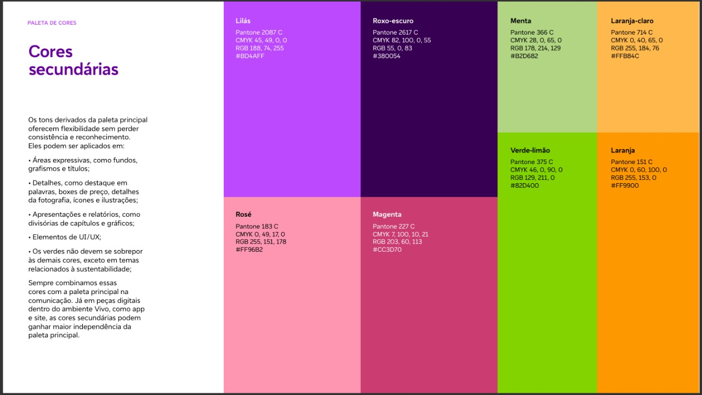

# 🖨️ Desafio Técnico - Sistema de Gestão de Impressoras

## 📋 Sobre o Desafio

Este desafio técnico avalia suas competências em desenvolvimento fullstack com **React (Next.js)** e **Spring Boot**. O objetivo é criar um sistema completo de gestão de impressoras corporativas com funcionalidades de CRUD, monitoramento de status e sincronização automática com API externa.

## 🎯 Objetivo Principal

Desenvolver uma aplicação web que permita:

- **Gestão completa de impressoras**: Operações de criação, leitura, atualização e exclusão
- **Monitoramento em tempo real**: Verificação do status operacional de cada equipamento
- **Integração automatizada**: Sincronização periódica com sistema externo para atualização da base de dados

## 🛠️ Stack Tecnológica Obrigatória

### Frontend

- **Next.js 14** com App Router
- **Tailwind CSS** para estilização
- **TanStack Query (React Query)** para cache e sincronização de dados
- **React Hook Form + Zod** para formulários e validação
- **shadcn/ui** para biblioteca de componentes
- **Axios ou Fetch** para comunicação HTTP

### Backend

- **Spring Boot 3** com Java 17+
- **Spring Web + Spring Data JPA** para camada de persistência
- **MySQL** como sistema de banco de dados
- **RestTemplate/WebClient** para consumo de APIs externas
- **Bean Validation** para validação de dados

## 🔄 Integração com API Externa

### Especificações de Sincronização

- **Estratégia de dados**: Atualizar os dados da impressora no banco utilizando o id como identificador exclusivo, garantindo que não haja duplicações.
- **Tratamento de falhas**: Logging detalhado de erros sem interromper o fluxo da aplicação
- **Auditoria**: Registrar métricas de sincronização (sucessos, falhas, registros processados)
- **Agendamento**: Configurar `@Scheduled` para execução automática em intervalos definidos de 1 hora

## 🖥️ Especificações Funcionais

### Interface do Usuário (Frontend)

**Tela Principal - Dashboard de Impressoras**

- Layout em grid responsivo com cards informativos
- Sistema de filtros por nome, modelo e localização
- Paginação configurável (padrão: 10 itens por página)
- Indicadores visuais de status com cores distintas
- Botões de ação (editar, excluir, ver status) em cada card

**Formulário de Gestão (Modal)**

- Validação em tempo real com feedback visual
- Marcação clara de campos obrigatórios
- Prevenção de submissões duplicadas
- Mensagens de sucesso/erro contextualizadas
- Responsividade para dispositivos móveis

**Visualização de Status**

- Modal dedicado para exibição de informações detalhadas
- Dados atualizados automaticamente
- Interface limpa e intuitiva

### Interface de Programação (Backend)

**Endpoints da API REST**

```http
GET    /api/v1/printers                    # Listagem com paginação e filtros
POST   /api/v1/printers                    # Criação de nova impressora
GET    /api/v1/printers/{id}               # Busca por identificador
PUT    /api/v1/printers/{id}               # Atualização completa
DELETE /api/v1/printers/{id}               # Exclusão lógica ou física
GET    /api/v1/printers/{id}/status        # Status operacional (mock)
GET    /api/v1/sync/statistics             # Métricas de sincronização
```

**Estrutura de Resposta - Status da Impressora**

```json
{
  "status": "ONLINE",
  "paperLevel": 67
}
```

**Padrões de Response**

- Códigos HTTP apropriados (200, 201, 400, 404, 500)
- Estrutura consistente para erros e sucessos
- Paginação padronizada para listagens
- Timestamps em formato ISO 8601

## 📋 Requisitos de Implementação

### Configuração Base

- [ ] Estruturação de projeto seguindo convenções (frontend/backend separados)
- [ ] Configuração de ambiente de desenvolvimento com Docker Compose
- [ ] Setup de banco de dados MySQL com scripts de inicialização
- [ ] Configuração de CORS adequada para comunicação frontend/backend

### Frontend - React/Next.js

- [ ] Arquitetura de componentes reutilizáveis com shadcn/ui
- [ ] Implementação de hooks customizados para operações de API
- [ ] Schema de validação Zod para todos os formulários
- [ ] Estados de loading, erro e sucesso bem definidos
- [ ] Design responsivo

### Backend - Spring Boot

- [ ] Camada de entidades JPA com relacionamentos bem definidos
- [ ] Repositories com consultas otimizadas (quando necessário)
- [ ] Services implementando regras de negócio
- [ ] Controllers com tratamento adequado de exceções
- [ ] Configuração de logs estruturados

### Integração e Qualidade

- [ ] Cliente HTTP configurado para consumo de API externa
- [ ] Scheduler operacional com tratamento de erros
- [ ] Implementação de pelo menos 5 testes unitários por camada (opcional)
- [ ] Documentação básica de endpoints (Swagger/OpenAPI opcional)

## 💡 Orientações Estratégicas

### Priorização de Desenvolvimento

**Implemente nesta ordem**: CRUD básico funcionando → Interface responsiva → Integração externa → Melhorias e extras

### Qualidade do Código

- Organize o projeto com estrutura de pastas clara e consistente
- Utilize nomenclatura descritiva para variáveis, métodos e componentes
- Implemente tratamento básico de erros em todas as operações críticas

### Entrega Eficaz

É preferível entregar funcionalidades completas e bem implementadas do que tentar fazer tudo parcialmente. Foque na qualidade da execução.

## 📊 Critérios de Avaliação

| Critério           | Peso  | Descrição                                                         |
| ------------------ | ----- | ----------------------------------------------------------------- |
| **Funcionalidade** | Alto  | CRUD Completo, integração externa, scheduler operacional          |
| **Arquitetura**    | Alto  | Estrutura do projeto, separação de responsabilidades, organização |
| **Tecnologias**    | Médio | Uso adequado e eficiente das ferramentas especificadas            |
| **Interface**      | Médio | Usabilidade, responsividade, experiência do usuário               |
| **Documentação**   | Baixo | README claro, comentários no código, instruções de setup          |

### Diferenciais (Pontos Extras)

- [ ] **Containerização**: Docker configurado para toda a aplicação
- [ ] **Testes automatizados**: Cobertura superior a 60%
- [ ] **Monitoramento**: Health checks e métricas básicas
- [ ] **Segurança**: Validações de entrada e sanitização

## 🚀 Especificações de Entrega

### Estrutura Obrigatória do Repositório

```
printer-management-system/
├── frontend/              # Aplicação Next.js
│   ├── src/
│   ├── public/
│   └── package.json
├── backend/               # API Spring Boot
│   ├── src/main/java/
│   ├── src/main/resources/
│   └── pom.xml
├── docker-compose.yml     # Environment de desenvolvimento
├── README.md              # Documentação principal
└── docs/                  # Documentação adicional (opcional)
```

### Documentação Obrigatória (README.md)

- **Descrição**: Visão geral do projeto e principais funcionalidades
- **Tecnologias**: Lista das ferramentas utilizadas
- **Pré-requisitos**: Software necessário (Java, Node.js, Docker, etc.)
- **Instalação**: Comandos step-by-step para setup local
- **Execução**: Como rodar frontend, backend e banco de dados
- **API**: Lista dos principais endpoints disponíveis
- **Decisões técnicas**: Justificativas para escolhas importantes (opcional)

### Modalidade de Entrega

1. **Fork do repositório original no GitHub** o participante deve realizar um fork deste projeto para sua conta pessoal e trabalhar diretamente nele.
2. **Branch main** estável com a versão final da aplicação
3. **Commits bem estruturados** com mensagens descritivas em português
4. **Aplicação executável** com README.md atualizado, substituindo o original e contendo todas as instruções de execução.

## ⏰ Prazo Final

**72 horas (3 dias)** a partir do recebimento deste documento.

## 🔗 Recursos de Apoio

- **API Externa**: `https://mt.tracerly.net`
- **Design System**: shadcn/ui possui documentação completa online

## 🔗 Observações

- As funcionalidades descritas como opcionais, só contarão como pontos extras, foque primeiramente nas funcionalidades não opcionais.

## Paleta de cores




---

**Dúvidas pontuais?** Contato disponível whatsapp

**Sucesso na implementação!** 🎯
